# Hotel Management System

A multi-platform hotel management system built with .NET, consisting of three integrated applications sharing a common backend, a guest-facing web app, a staff desktop client, and a personnel task portal.

---

## Architecture

| Project | Platform | Purpose |
|---|---|---|
| `HotelManagement.Web` | ASP.NET MVC | Guest portal — browse and book rooms |
| `HotelManagement.Desktop` | WPF | Staff dashboard — manage rooms, reservations and tasks |
| `HotelManagement.Personnel` | Blazor | Personnel portal — view and complete assigned tasks |
| `HotelManagement.Shared` | Class Library | Shared models, database context and migrations |

All projects connect to the same database via **Entity Framework Core**, with **ASP.NET Core Identity** handling authentication.

---

## Web — Guest Portal

Guests can register, log in, search for available rooms by date and preferences, and make reservations.

| Home | Search | Available Rooms |
|---|---|---|
| 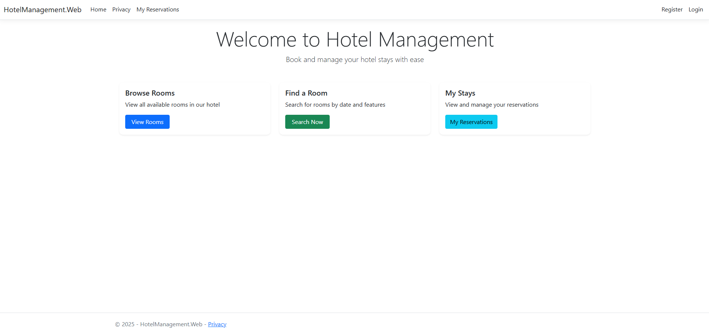 | 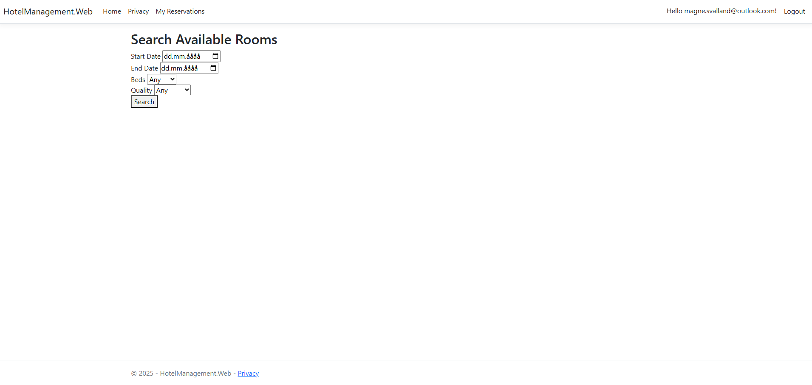 | 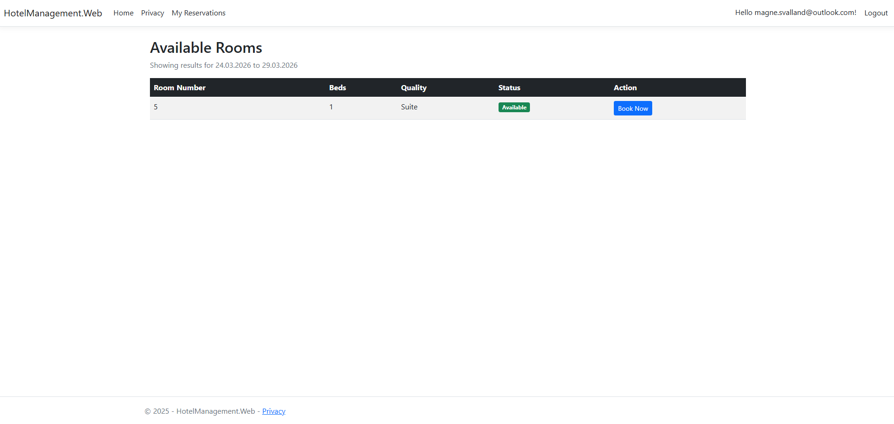 |

| Login | Room List | My Reservations |
|---|---|---|
| 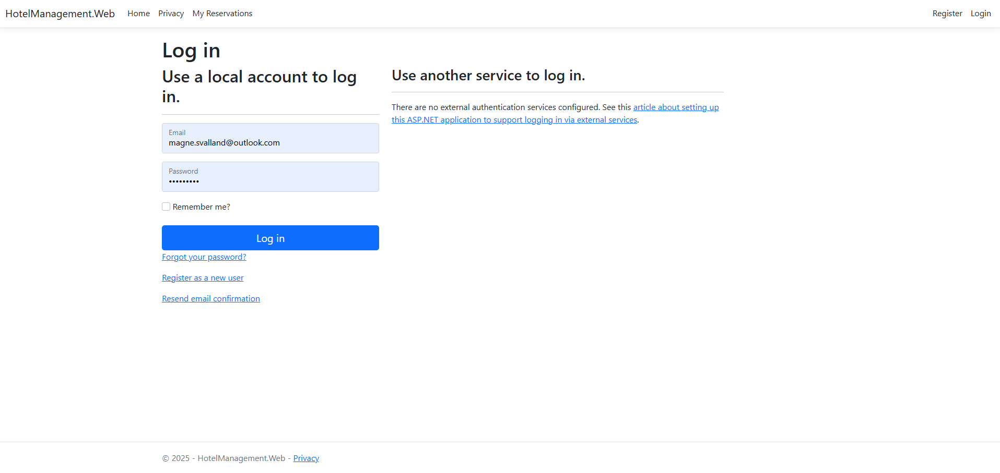 | 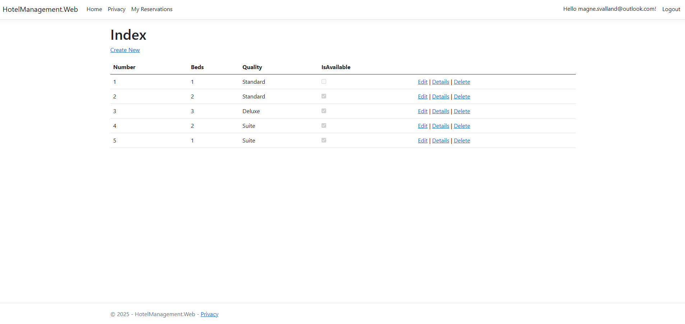 | 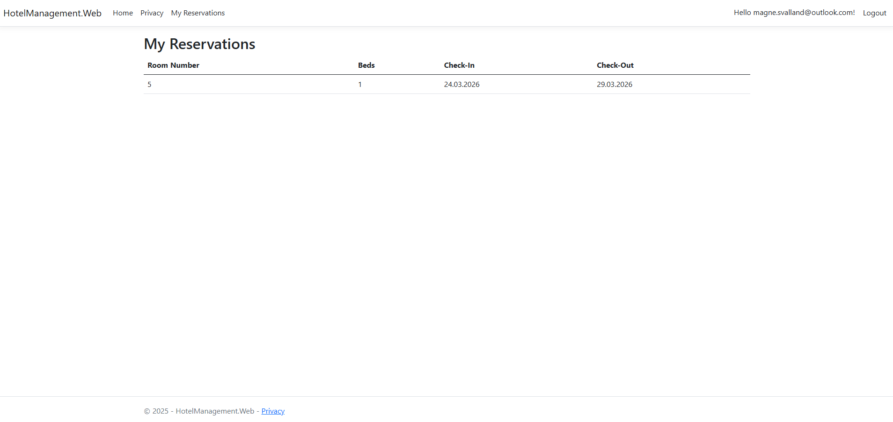 |

---

## Desktop — Staff Dashboard

Staff log in via a WPF desktop application to manage all rooms. Each room shows its current status, active reservations and room tasks. Staff can check guests in/out, add reservations and register tasks.

| Login | Room Overview |
|---|---|
| 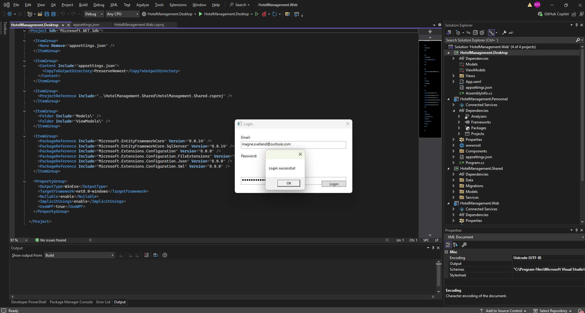 | 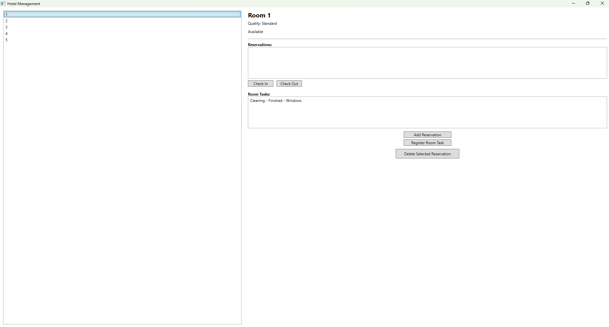 |

| Add Reservation | Check Out | Register Task |
|---|---|---|
| 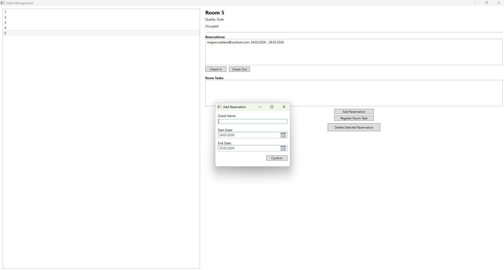 | 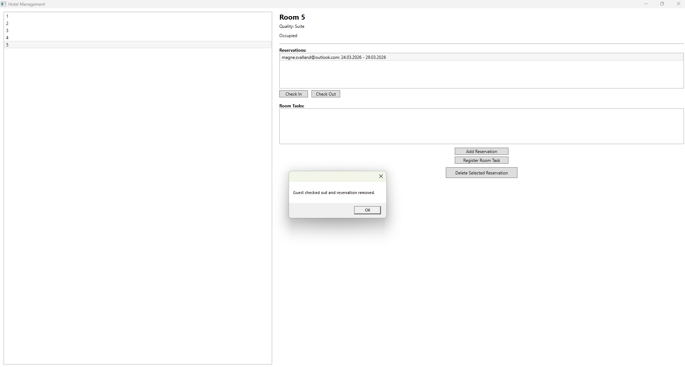 | 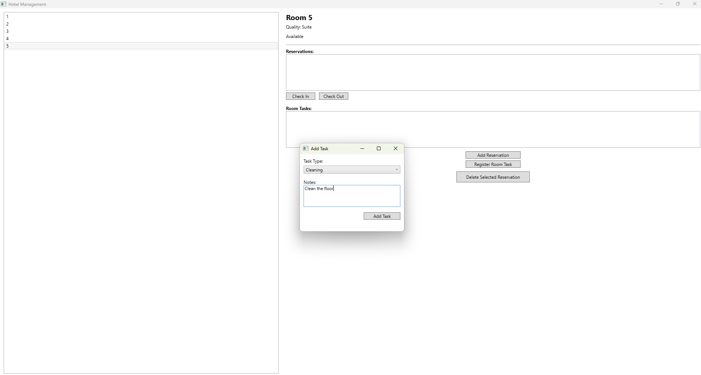 |

---

## Personnel — Task Portal

Personnel log in and select their role (Cleaning Staff, Maintenance, Room Service). They see their assigned tasks with status tracking from **New → In Progress → Finished**.

| Role Selection | Tasks | In Progress |
|---|---|---|
| 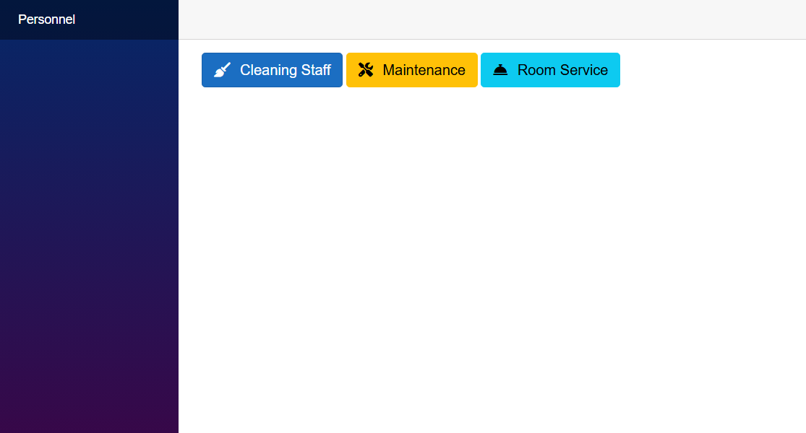 | 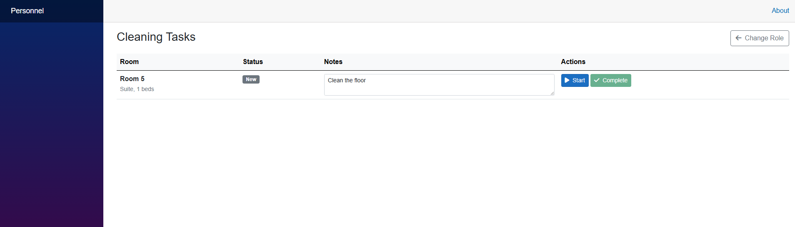 | 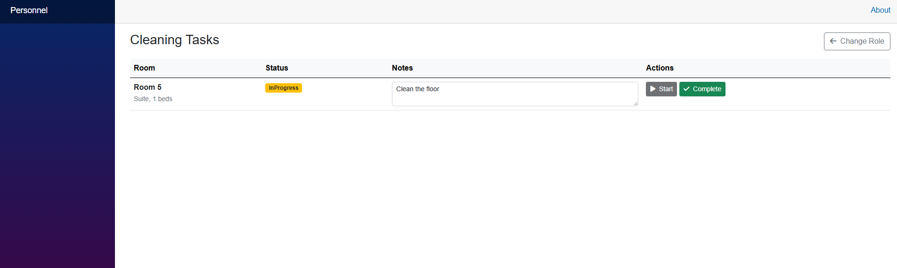 |

---

## Tech Stack

- **C#** · **.NET 8** · **WPF** · **ASP.NET MVC** · **Blazor**
- **Entity Framework Core** · **SQL Server**
- **ASP.NET Core Identity**
- **Azure** (cloud-hosted database)

---

## How to Run

1. Clone the repository
2. Open `HotelManagement.Web.sln` in Visual Studio
3. Update the connection string in `appsettings.json` to point to your database
4. Run migrations: `Update-Database` in Package Manager Console (set `HotelManagement.Shared` as default project)
5. Set multiple startup projects: right-click solution → **Set Startup Projects** → select `Web`, `Desktop` and `Personnel`
6. Press **F5**
